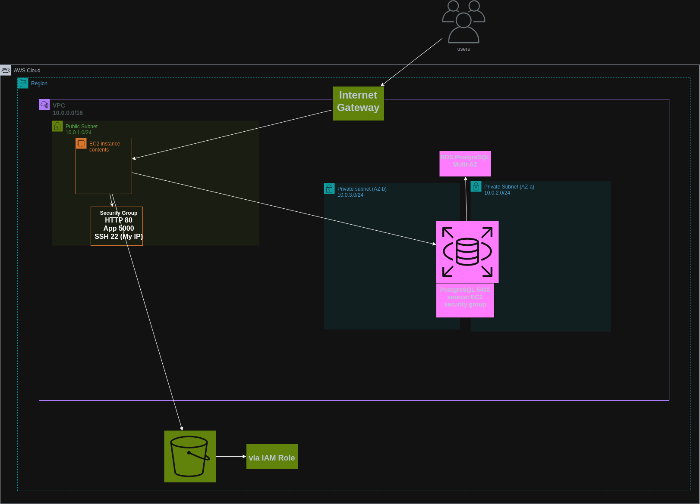

# 🚀 AWS Infrastructure with Terraform

This project provisions a secure AWS cloud infrastructure using Terraform. It follows cloud best practices, including **network isolation**, **controlled access**, and **high availability**.

The goal is to demonstrate how to deploy a **production-style infrastructure** using **Infrastructure as Code (IaC)**.

---

## 🏗️ Architecture Overview

The infrastructure separates **public-facing components** from **internal resources** to improve security and scalability:

* Users access the application through the **Internet Gateway**.
* The **EC2 instance** runs in a **public subnet**.
* The **PostgreSQL database (RDS)** runs in **private subnets**.
* The application can securely access **Amazon S3** via an **IAM Role**.

---

## 📊 Architecture Diagram



---

## ⚙️ Prerequisites

Before deploying, ensure you have:

* An **AWS Account** with SSO configured
* **Terraform ≥ 1.5**
* **AWS CLI v2**
* An **EC2 Key Pair**
* **Git** installed locally

---

## 🚀 Deployment & Setup

### Step 1: Configure AWS CLI for SSO Authentication

```bash
aws configure sso
aws sso login
```

---

### Step 2: Initialize Terraform

```bash
terraform init
terraform plan
terraform apply
```

---

### Step 3: Verify IAM Role Permissions on EC2

SSH into the instance:

```bash
ssh -i <KEY_NAME>.pem ec2-user@<PUBLIC_IP>
```

Check role and S3 access:

```bash
aws sts get-caller-identity   # Confirms the IAM role is assumed
aws s3 ls s3://grocerymate-avatars-ljubica/avatars/  # Confirms S3 access
```

---

### Step 4: Clone Repository

```bash
git clone https://github.com/ellakrog/AWS_grocery.git
cd AWS_grocery/
git pull origin version2
```

---

### Step 5: Install Dependencies

```bash
sudo yum update -y
sudo yum install -y git python3 python3-pip postgresql15 postgresql15-server postgresql15-contrib
```

Verify installations:

```bash
git --version
python3 --version
pip --version
psql --version
```

---

### Step 6: Install Docker

```bash
sudo yum install -y docker
sudo systemctl start docker
sudo systemctl enable docker
sudo systemctl status docker
```

Allow the EC2 user to run Docker **without sudo**:

```bash
sudo usermod -aG docker ec2-user
newgrp docker  # Apply group changes immediately
docker info    # Verify Docker is working
```

---

### Step 7: Build and Run the Application

Create a `.env` file in `backend/`:

```env
S3_BUCKET_NAME=grocerymate-avatars
S3_REGION=eu-central-1
USE_S3_STORAGE=true
POSTGRES_USER=grocery_user
POSTGRES_PASSWORD=grocery_test
POSTGRES_DB=grocerymate_db
POSTGRES_HOST=<your-rds-endpoint>
POSTGRES_URI=postgresql://${POSTGRES_USER}:${POSTGRES_PASSWORD}@${POSTGRES_HOST}:5432/${POSTGRES_DB}
```

Build and run Docker:

```bash
cd backend/
docker build -t grocerymate .
docker run --network host --env-file .env -p 5000:5000 grocerymate
```

---

### Step 8: Verify the Application

Open a browser and visit:

```
http://<your-ec2-ipv4>:5000
```

You should see the **GroceryMate application** running successfully.

---

## 🧹 Cleanup (Optional)

To remove all AWS resources created by Terraform:

```bash
terraform destroy
```
